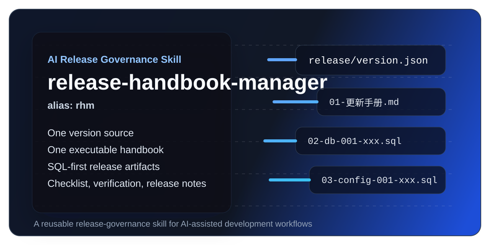

# release-handbook-manager



[中文](./README.md) | [English](./README.en.md)

> This repository now provides a bilingual landing page.  
> For the full bilingual introduction, please refer to [README.md](./README.md).

`release-handbook-manager` is a reusable release-governance Skill for AI-assisted software delivery.

It is designed to reduce the repeated effort teams spend organizing release materials, release steps, and change summaries during AI-assisted development.

> Important:
> This Skill is primarily designed for projects where AI is deeply involved throughout development.
> It works best when AI continuously participates in requirement analysis, implementation, change tracking, and release preparation.
> If a team barely uses AI during development and only brings it in near release time, this Skill is not a good fit.

It helps teams turn release work from scattered notes and ad-hoc steps into a repeatable workflow built around:

- one version source of truth
- one executable release handbook
- required SQL artifacts for scriptable changes
- explicit manual-operation records for non-scriptable changes
- reusable release checks, verification records, and release notes

Its chat alias is `rhm`.

## At a glance

- **Purpose**: standardize release preparation and release execution
- **Primary use**: initialize, maintain, and inspect release materials for a project
- **Version source**: `release/version.json`
- **Version maintenance**: **Veto Redline — version number MUST be maintained by explicit human instruction; AI auto-generation / auto-bump / auto-upgrade is strictly prohibited**
- **Version format**: `vMajor.Minor.Patch`
- **Default model**: one top-level version per project, even in multi-module repositories
- **SQL validation**: mandatory SQL header (4 fields) + tail validation SQL + multi-segment per-segment validation (details + summary + failures)
- **Companion Skill**: `release-test-auto` (alias `rta`) — companion automation test skill for IDE-terminal resumable UAT/regression execution based on the 05-1 truth source
- **Documentation language**: the most complete docs are currently in Simplified Chinese, with this English README provided as the public entry page

## Why this exists

Many teams can finish coding, but before release they still spend extra effort trying to reconstruct:

- what changed in the current version
- which database and config operations must be executed
- what the release sequence should be
- how the final release notes should be written

If those materials are not accumulated during development, the release phase usually breaks down in familiar ways:

- no single source of truth for the version number
- database scripts are scattered across chats, temp files, or personal machines
- teams still rely on manual and repetitive admin-page operations for menu, permission, and role-authorization data updates after release
- release handbooks read like notes instead of execution guides
- final release notes are reconstructed from memory

`release-handbook-manager` is designed to turn those weak spots into durable release assets:

- a single source of truth for the version number
- a single source of truth for the release handbook
- required SQL artifacts for scriptable changes
- explicit manual-operation steps when scripting is not possible
- reusable release checklist and verification materials

## What it helps you do

This Skill is primarily designed to help with five practical release problems:

1. **Reduce the repeated work of organizing release materials**  
   Teams do not need to manually reconstruct release notes, release steps, and functional summaries every time a version is about to ship.

2. **Automatically record change history during development**
   When AI continuously participates in development, version-related changes can be accumulated during development instead of being reconstructed right before release.

3. **Automatically generate SQL and other release scripts**
   When the AI has sufficiently complete context, scriptable release work such as schema changes, data repair, menu setup, and permission setup can be turned into executable artifacts.

4. **Automatically generate release execution steps**
   When enough context and supporting materials are available, the release sequence can be organized into a clear order that covers checks, scripts, manual steps, verification, and rollback notes.

5. **Automatically generate version update logs**
   Final release notes can be derived from the materials accumulated during development.

## Core capabilities

### 1. Initialize release governance for a project

- create `release/version.json`
- create a project-level release governance rule file
- create `release/versions/{version}/`
- initialize the handbook, release checklist, post-release verification record, and release notes

### 2. Maintain release materials for the current version

- read the current version number
- identify whether the change affects schema, data migration, menus, permissions, role grants, dictionaries, params, process templates, config files, or production settings
- generate or complete required `02-db-xxx.sql` and `03-config-xxx.sql` files
- write the changes back into `01-更新手册.md`

### 3. Run a pre-release inspection

- verify the version number and directory match
- check whether SQL artifacts are missing
- verify manual steps include clear entry points, order, target results, and validation methods
- verify rollback and post-release validation materials are complete

## How it works

The Skill follows a three-stage workflow:

### 1. Initialize

Use it when a project does not yet have release governance in place.

It creates:

- `release/version.json`
- a project-level release-governance rule file
- the current version directory
- handbook and verification templates

### 2. Maintain

Use it while development is in progress.

It helps record:

- what changed in the current version
- which items must be delivered as SQL
- which items must remain manual and how to execute them
- what should appear in the final release notes

### 3. Inspect

Use it before shipping.

It checks whether:

- the version source and version directory match
- required SQL artifacts are present
- manual steps are specific enough to execute safely
- verification and rollback materials are complete

## Design principles

### Version numbers do not depend on Git

- `release/version.json` is the only source of truth for the current version
- the version format is fixed to `vMajor.Minor.Patch`

### Version numbers must be maintained manually (Veto Redline)

- The `version` field **must** be written only by an explicit human instruction; AI must **never** auto-generate, auto-bump, or auto-upgrade the version number under any scenario
- AI is only allowed to write the `version` field in exactly two cases: (1) human explicitly provides the exact target version and asks to write it; (2) human explicitly instructs a version-change intent
- During initialization, if no human-provided version is available, a placeholder (e.g. `vX.Y.Z`) must be used with a clear prompt for manual completion

### Everything scriptable must be scripted

The following items must be delivered as SQL, not vague notes:

- schema changes
- column, primary key, foreign key, index, and constraint changes
- stored procedure and trigger changes
- historical data fixes, backfills, and migrations
- menu, permission, and role-permission changes backed by the database

### SQL scripts must be verifiable (Mandatory Rule)

Every SQL script must also be verifiable:

- **Fixed header area with 4 fields**: Script Purpose / Execution Preconditions / Expected Results / Quick Post-Execution Check
- **Tail validation area**: must append `-- 【Post-Execution Validation SQL】` with runnable validation SQL using PASS/FAIL, COUNT, SUM, and other deterministic patterns
- **Multi-segment scripts require per-segment validation**: each segment writes result to temp table immediately after execution; final output must include details + success_count + fail_count + failed-segment list. A single vague aggregate query at the end is strictly prohibited.

### Manual operations must still be explicit

These scenarios may remain manual:

- modifying existing config files
- production-environment configuration
- cases that truly cannot be scripted

Even then, the handbook must still record:

- entry point
- execution order
- operation content
- expected result
- validation method

## Recommended structure

```text
release/
  version.json
  versions/
    v1.0.0/
      01-更新手册.md
      02-db-001-数据库结构变更.sql
      02-db-002-历史数据修复.sql
      03-config-001-菜单权限配置.sql
      03-config-002-角色权限配置.sql
      04-发布检查清单.md
      05-发布后验证记录.md
      05-1-功能验收用例(非技术版).md
      06-版本更新日志.md
```

Notes:

- `02` and `03` are not nested into extra folders
- all files stay in one flat level
- file prefixes directly encode category and execution order
- `05` (tech-facing verification, for QA/developers) and `05-1` (non-tech UAT acceptance, for PM/business users) go hand in hand as a dual-track pair; 05-1 uses an 8-column structure · full-level output, with **Output Mode Switch (A Internal / B External Delivery)**

### §3.2 Directory Conventions

- It is **strictly prohibited** to store temporary command markdown files such as `YYYYMMDD-Windows-Terminal` under the `versions/` directory. Such temporary command records must be consolidated into §4.1.3 of `01-更新手册.md`.

## Default release model

This Skill assumes a **single project-level release version** by default.

For repositories that contain multiple directories such as:

- `backend`
- `frontend`
- `client`
- `uniapp`

the recommended approach is still:

- one top-level version source in `release/version.json`
- one release handbook per release version
- module involvement recorded inside the handbook, rather than introducing separate primary version files for each module

## Typical use cases

- reduce repeated release-preparation work in AI-assisted development
- automatically accumulate version change records during development
- automatically generate database SQL, config scripts, and other release artifacts
- produce clear release execution steps for shipping
- generate final release notes directly from development-time materials

## Quick start

### 1. Put the Skill into your project

Copy the Skill file into your Skill directory, for example:

```text
.trae/skills/release-handbook-manager/SKILL.md
```

### 2. Initialize release governance in chat

```text
Please use rhm to initialize release governance for the current project, and set the version to v1.0.0
```

### 3. Maintain release materials during development

```text
Use rhm to maintain the current version changes
```

```text
Use rhm to generate release materials for this task
```

### 4. Inspect before release

```text
Use rhm to check whether v1.0.0 is ready for release
```

## Example prompts

```text
Please use rhm to initialize release governance for the current project, and set the version to v1.0.0
```

```text
Use rhm to maintain the current version changes. This task includes one schema change, two permission SQL scripts, and one production-only manual config step.
```

```text
Use rhm to check whether v1.1.0 is ready for release
```

## §4 File Descriptions

### §4.2 Files Inside Version Directory

| File No. | File Name Template | Description |
|---------|-------------------|-------------|
| 01 | `01-更新手册.md` | Source-of-truth release handbook: change summary, SQL/manual step references, release order, rollback notes, §4.1.3 temp-command consolidation area |
| 02 | `02-db-*.sql` | Scriptable database operations: schema changes, historical data repair, backfill, migration |
| 03 | `03-config-*.sql` | Database-driven configuration scripts: menu setup, permission grants, role grants, dictionaries, params |
| 04 | `04-发布检查清单.md` | Pre-release checklist: environment consistency, script completeness, permission verification |
| 05 | `05-发布后验证记录.md` | Tech-facing post-release verification (for QA/dev): APIs, database, logs, performance |
| **05-1** | **`05-1-功能验收用例(非技术版).md`** | **Non-tech version · for Product Manager / UAT / Business-user acceptance checklist: 8-column structure · full-level output · with Output Mode Switch (A Internal Review / B External Delivery); 8 columns: Module, Scenario, Precondition, Steps, Expected, Priority P0/P1/P2, Actual, Approver** |
| 06 | `06-版本更新日志.md` | External release notes, grouped by Features / Fixes / Improvements |

## Repository layout

```text
release-handbook-manager/
  README.md
  README.en.md
  LICENSE
  assets/
    cover.svg
  docs/
    20260715-快速开始.md
    20260715-使用示例.md
    20260715-设计说明.md
  templates/
    project-rules/
      20260715-08-协作-版本发布与更新手册规则.md
    basic-release/
      release/
        version.json
        versions/
          v1.0.0/
            01-更新手册.md
            04-发布检查清单.md
            05-发布后验证记录.md
            05-1-功能验收用例(非技术版).md
            06-版本更新日志.md
  skills/
    release-handbook-manager/
      SKILL.md
    release-test-auto/
      SKILL.md        # Companion automation test skill: alias rta, runs resumable IDE-terminal tests from the 05-1 truth source
  examples/
    basic-release/
      release/
        version.json
        versions/
          v1.0.0/
            01-更新手册.md
            04-发布检查清单.md
            05-发布后验证记录.md
            05-1-功能验收用例(非技术版).md
            06-版本更新日志.md
```

## Docs

- [Documentation Index](./docs/20260715-%E6%96%87%E6%A1%A3%E5%AF%BC%E8%88%AA.md)
- [Quick Start](./docs/20260715-%E5%BF%AB%E9%80%9F%E5%BC%80%E5%A7%8B.md)
- [GitHub Release Preparation](./docs/20260715-GitHub%E5%8F%91%E5%B8%83%E5%87%86%E5%A4%87.md)
- [Usage Examples](./docs/20260715-%E4%BD%BF%E7%94%A8%E7%A4%BA%E4%BE%8B.md)
- [Design Notes](./docs/20260715-%E8%AE%BE%E8%AE%A1%E8%AF%B4%E6%98%8E.md)

## Template links

- [Rule template](./templates/project-rules/20260715-08-%E5%8D%8F%E4%BD%9C-%E7%89%88%E6%9C%AC%E5%8F%91%E5%B8%83%E4%B8%8E%E6%9B%B4%E6%96%B0%E6%89%8B%E5%86%8C%E8%A7%84%E5%88%99.md)
- [Base release template directory](./templates/basic-release/release/)
- [Distributable Skill](./skills/release-handbook-manager/SKILL.md)

## Community

- [Contributing](./CONTRIBUTING.md)
- [Security Policy](./SECURITY.md)
- [Code of Conduct](./CODE_OF_CONDUCT.md)
- [PR Template](./.github/PULL_REQUEST_TEMPLATE.md)

## Who this is for

This repository is a good fit if you:

- use AI coding assistants in real projects
- have AI continuously involved across requirements, coding, change tracking, and release preparation
- want release preparation to be reproducible instead of informal
- need database and permission changes to be treated as first-class release artifacts
- want release notes to come from development-time materials rather than end-of-cycle reconstruction

## Capability boundary

- This Skill cannot infer undocumented release changes out of thin air.
- If a project barely uses AI during development or only brings AI in shortly before release, this Skill is not a good fit.
- If AI was not deeply involved during development, it cannot reliably determine all feature changes, required SQL, scripts, or release steps automatically.

## Current status

- core workflow is defined
- initialization, maintenance, and inspection modes are supported
- the `rhm` chat alias is supported
- the flat release-material structure is documented
- **[NEW] Veto Redline: version number must be maintained manually — AI auto-generation / auto-bump / auto-upgrade is strictly prohibited**
- **[NEW] Mandatory verifiable SQL scripts — 4-field header + tail validation SQL + multi-segment per-segment validation (details + summary + failures)**
- **[NEW] 05-1 role-account migration rule — test account/password are migrated from the previous version's 05-1 file, matching by role column; only the immediate previous version is allowed for fallback**
- **[NEW] Companion Skill `release-test-auto` (alias `rta`) — resumable IDE-terminal automation test execution based on the 05-1 truth source, with test-data restore, breakpoint resume, and both positive + negative test coverage**

## Author and Maintainer

- Author: Ray
- Company: 东创华珞（武汉）国际科创有限公司
- Website: <https://www.dcipo.com>

## Future extensions

- module-level auxiliary version records
- configurable templates
- multi-database SQL templates
- layered release-note generation
- CI/CD or approval-flow integration

## License

This repository is released under the [MIT License](./LICENSE).
