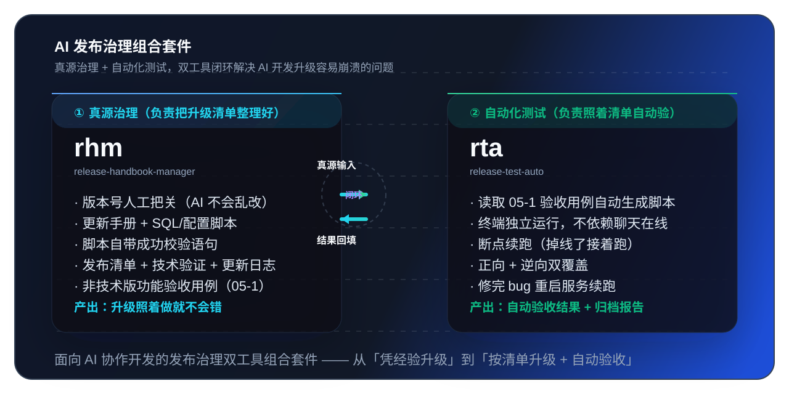

# 系统升级安全助手（rhm）



> 用 AI 开发系统时，最担心的就是「升级一次崩一次」。
> 这套工具就是专门帮你解决这个问题的——把每次升级要做的事情提前整理好，照着做不出错。

---

## 一句话介绍它是干嘛的

你用 AI 帮你改完代码、加完功能之后，要把这些改动正式部署上线（也就是「升级系统」）。这一步最容易出问题：

- 忘了改某个后台配置
- 漏跑了一条数据库脚本
- 不知道要按什么顺序操作
- 升级完才发现哪里不对，但已经不好回退了

**这个工具就是帮你把「每次升级要做的所有事情」提前整理成一套清单和脚本，人照着执行就不会出错。**

---

## 它到底帮你解决了哪些具体问题

| 升级时经常遇到的坑 | 这个工具怎么帮你填上 |
|---|---|
| 「这次到底改了哪些东西？升级前根本记不全」 | 自动帮你整理一份更新手册，改了什么一目了然 |
| 「数据库脚本散落在聊天记录里，上线时找不到正确的那一份」 | 所有脚本统一放在一个文件夹里，编号排好顺序 |
| 「菜单、权限、角色都是后台手工加的，每次升级都要重新点一遍」 | 自动生成可以直接执行的 SQL 脚本，一条命令搞定，不用手工点 |
| 「脚本跑完不知道有没有成功，只能看日志猜」 | 每条脚本都自带「成功怎么判断」的验证语句，跑完运行一下就知道过没过 |
| 「AI 经常自动乱改版本号，越改越乱」 | 版本号强制人工把关，AI 不能自己瞎改 |
| 「升级时操作顺序全靠记忆，顺序错了系统就崩」 | 发布前有检查清单，发布步骤按顺序一条条写好 |
| 「升级完要给领导/客户写更新说明，又要重新整理一遍」 | 自动从已整理的材料里提炼出更新说明，不用再重写 |
| 「功能验收要点来点去，每次升级都要重新测一遍」 | 配套还有自动化测试工具（rta），帮你自动跑验收用例 |

---

## 用了它之后，升级流程变成什么样

以前的升级：
> 开发临时回忆改了什么 → 到处找脚本 → 群里问有没有要改的配置 → 凭感觉执行 → 出问题再抢修

用了它之后的升级：
> 开发过程中，AI 边改边把要升级的内容记下来 → 升级前所有脚本、步骤、验证方法全部整理齐全 → 按清单一步一步执行 → 每一步跑完都有验证 → 结束后自动生成更新说明

**简单说：从「凭经验升级」变成「按清单升级」。**

---

## 都有哪些东西（非技术版理解）

| 文件夹/文件 | 它是什么（大白话） |
|---|---|
| `release/version.json` | 记录当前系统版本号的「唯一正确答案」，别的地方都不算数 |
| `release/versions/当前版本号/01-更新手册.md` | 本次升级的总说明书：改了什么、有哪些脚本、按什么顺序做、出问题怎么回退 |
| `02-db-xxx.sql` | 改数据库的脚本，直接执行就行 |
| `03-config-xxx.sql` | 改菜单、权限、角色等配置的脚本，直接执行就行 |
| `04-发布检查清单.md` | 升级前要核对的清单，防止漏东西 |
| `05-发布后验证记录.md` | 升级后，技术人员要做的验证项和结果记录 |
| `05-1-功能验收用例(非技术版).md` | 升级后，产品经理/业务人员/客户可以照着检查的验收清单（页面操作、能看懂） |
| `06-版本更新日志.md` | 给用户/客户看的更新说明，可以直接发出去 |

---

## 配套还有一个自动化测试工具（rta）

如果你觉得每次升级还要人工一条一条点页面验收太累，本仓库还配套了一个「自动化测试执行工具」：

- 聊天简称：**rta**
- 作用：照着上面的「05-1 非技术验收清单」，在电脑终端自动跑验收，支持断点续跑，中途会话断了也能接着跑
- 适合：业务功能比较稳定、每次升级都要回归测试的场景

---

## 怎么开始用（最简化三步）

### 第一步：把它放进你的项目

把 `skills/release-handbook-manager/SKILL.md` 放到你自己项目的 Skill 目录里，例如：

```text
.trae/skills/release-handbook-manager/SKILL.md
```

### 第二步：让 AI 帮你初始化

在聊天里对 AI 说：

```
请用 rhm 初始化当前项目的版本发布治理，版本号先设为 v1.0.0
```

> ⚠️ **重要提醒**：版本号必须由人来定，AI 不会自己乱改。上面例子里你把「v1.0.0」换成你自己想要的版本号就行。

### 第三步：开发过程中持续维护

每做完一个功能/改完一个需求，就在聊天里对 AI 说：

```
用 rhm 维护当前版本变更
```

或者：

```
用 rhm 为这次需求补发布材料
```

AI 会自动把这次改动需要注意的数据库脚本、配置脚本、手工操作事项补到发布材料里。

### 发布前检查一下

准备正式发布前对 AI 说：

```
用 rhm 检查 v1.0.0 是否可以发版
```

AI 会帮你核对所有脚本、步骤、清单是否齐全，没问题再发。

---

## 最常见问题

### Q1：我不是技术人员，这个东西对我有用吗？

有用。尤其「05-1 功能验收用例（非技术版）」就是专门给产品/业务/客户写的，每次升级照着一条条核对页面功能就可以，还可以切换成对外交付版直接发给客户。

### Q2：我团队基本不用 AI 开发，能用吗？

不推荐。这套工具最适合「AI 持续参与开发过程」的团队，如果基本不用 AI 开发，很多自动沉淀变更的能力发挥不出来。

### Q3：升级时能保证 100% 不崩吗？

不能保证 100%，但能**显著降低因为漏脚本、漏步骤、顺序错而导致的低级失误**。大多数升级崩溃都是因为这些低级失误，而不是逻辑本身有问题。

### Q4：SQL 脚本执行完怎么确认成功了？

每条脚本都强制要求自带「执行后校验语句」。举个例子：改完某个字段，脚本尾部会自带一条 SELECT 语句，跑完执行一下就能看到 PASS 还是 FAIL，不用靠肉眼翻日志猜。

### Q5：AI 会自己乱改版本号吗？

不会。这是本工具的**一票否决红线**——任何人（或 AI）都不能在没有人工明确指令的情况下改版本号。版本号必须由你明确说「把版本改成多少」才会执行写入。

---

## 仓库里有什么（快速看结构）

```text
release-handbook-manager/
  README.md                              ← 你正在看的这份说明
  skills/
    release-handbook-manager/SKILL.md   ← 主工具 AI 指令文件（放到项目里让 AI 读）
    release-test-auto/SKILL.md          ← 配套自动化测试工具 AI 指令文件
  templates/                            ← 模板文件，初始化时会用
    project-rules/                      ← 项目协作规则模板
    basic-release/                      ← 发布材料模板（版本号、7份文档等）
  examples/                             ← 最小示例，看一眼就知道长什么样
  docs/                                 ← 更详细的设计说明、快速开始、使用示例
```

---

## 文档导航

想看更细节内容可以看：

- [快速开始](./docs/20260715-%E5%BF%AB%E9%80%9F%E5%BC%80%E5%A7%8B.md)
- [设计说明（为什么这么设计）](./docs/20260715-%E8%AE%BE%E8%AE%A1%E8%AF%B4%E6%98%8E.md)
- [使用示例](./docs/20260715-%E4%BD%BF%E7%94%A8%E7%A4%BA%E4%BE%8B.md)
- [2026-09-05 版本发布治理能力增强-变更记录](./docs/20260905-%E7%89%88%E6%9C%AC%E5%8F%91%E5%B8%83%E6%B2%BB%E7%90%86%E8%83%BD%E5%8A%9B%E5%A2%9E%E5%BC%BA-%E5%8F%98%E6%9B%B4%E8%AE%B0%E5%BD%95.md)

---

## 作者信息

- 作者：Ray
- 公司：东创华珞（武汉）国际科创有限公司
- 官网：<https://www.dcipo.com>

## 许可证

本仓库使用 [MIT License](./LICENSE)。
